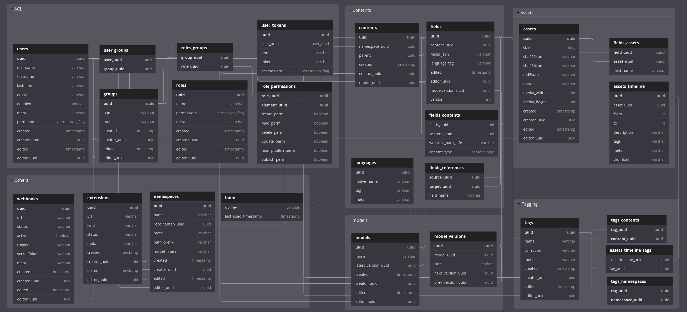

# Loom - DB

* api       - Generic API for DB access
* fs        - Filesystem specific implementation
* memory    - In-Memory specific implementation 
* hibernate - Hibernate specific implementation 
* model     - Database domain model

## Domain Model

See https://dbdiagram.io/d/6086e050b29a09603d123272
